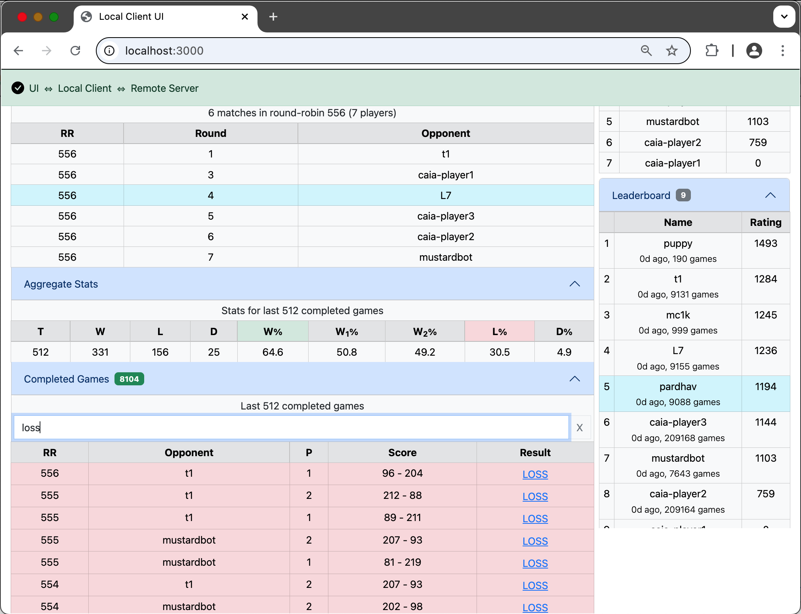

# CodeCup 2025 Box Online Multiplayer

An unofficial online multiplayer version of [CodeCup 2025](https://www.codecup.nl/intro.php) contest game [Box](https://www.codecup.nl/rules.php).

The purpose of this is to allow contestants to have their programs play against other programs **online** while they build and improve their programs for the test and final competitions of CodeCup 2025.  Contestants don't have to share their source code or the program binaries - their programs runs locally on their own systems and **only** the game moves are transmitted over to the other players - everything else like the completed game HTML's and logs generated are all local to the contestant.  A performance rating for each of the player is also assigned to help players gauge the competitiveness of their bots with respect to others.

The Box Online Multiplayer version has two components.  A **server** component that is hosted on a publicly accessible server and a **client** component that contestants run locally on their systems which invokes their program to play the Box games.  This repo has sources for both the components, but contestants only need the **client** component to participate.

- [Getting Started](#getting-started)
- [Game Results and Logs](#game-results-and-logs)
- [Command Line Interface](#command-line-interface-cli)
- [Hosted Server](#hosted-server)
- [Client Component](#client-component)
- [Server Component](#server-component)
- [Performance Ratings](#performance-ratings)
- [How it works](#how-it-works)

## Getting Started

The **client** component is a [Node.js](https://nodejs.org/) application and hence requires Node.js [installed](https://nodejs.org/en/download/package-manager) on your system.

Here are the instructions to get started:

```
git clone https://github.com/PardhavMaradani/cc25-box-online-multiplayer.git
cd cc25-box-online-multiplayer/client
npm install
npm start -- -s https://box.servegame.com -p /path/to/your/executable/box/program
```

> The program passed above with the `-p` option should be a single executable file.  Programs written in some languages (eg: Java) will need to be packaged within an executable script and the script should be passed as the parameter

After these commands are run in a terminal window, you should see something similar to:


Browse to [http://localhost:3000](http://localhost:3000) as mentioned in the console output in a browser to access the UI.  You should see something similar to:


Click on the `Start Session` button in the UI and that's it.  You will be scheduled in the next round-robin and games will be played against all other online players at that time.  The games will continue to get played in all future round-robin's till you explicitly click on `Stop Session` or your **client** disconnects for whatever reason.

You should see somthing like this in the browser while the games are in progress:


## Game Results and Logs

You can look under the `Completed Games` section to see the results of the recently completed games.  A free text filter can be used to filter the results as shown here:



You can click on the **Result** link of each game to see a familiar [`caia`](https://www.codecup.nl/download_caia.php) generated game HTML output as follows:


Your program logs that are typically written to stderr as per the [technical rules](https://www.codecup.nl/rules_tech.php) can be seen towards the end of the same HTML file.

All games are organised session wise (between a `Start Session` and an `End Session`) and they can be accessed from the `All Games` link at the bottom of the UI:


The `All Games` UI looks something like this, where you can browse per session and filter files as shown below:


## Command Line Interface (CLI)

If you only need the command line interface, you can start the **client** with a `-v` and `-a` options as seen below.  For a full list of all available **client** options, check out the [Client](client/README.md) page.

```
npm start -- -s https://box.servegame.com -p /path/to/your/executable/box/program -v -a
```

The `-v` option is to write verbose logs and the `-a` option is to auto start a session.

Here is a sample output:


All the game HTML files will be generated as before and can be found in the `all-games` folder.  You can turn off generating the HTML files, don't listen on the UI port and change several other configurable options as detailed in the [Client](client/README.md) page.

## Hosted Server

The Box Online Multiplayer **server** is hosted on a `e2-micro` VM instance in the `us-west1` region of [Google Cloud Platform](https://cloud.google.com/) (GCP) as this falls under the free-tier.  The server is accessible via a free [No-IP](https://www.noip.com) hostname as [https://box.servegame.com](https://box.servegame.com).  This is what the **clients** connect to by specifying the `-s https://box.servegame.com` option.  The [https://box.servegame.com](https://box.servegame.com) URL also show the current status of the server.


The source for the **server** component and all other details to host your own local / hosted server if required are available in the [Server](server/README.md) and [Docker](docker/README.md) pages.

## Client Component

All the details about the **client** component can be found in the [Client](client/README.md) page.

## Server Component

All the details about the **server** component can be found in the [Server](server/README.md) page.

## Performance Ratings

Details about how the performance ratings are calculated and the simulation code can be found in the [perf-rating](server/perf-rating/) directory.  The JavaScript implementation of the same can be found in the Server [code](server/index.js#L177).  Players need to have at least 100+ games completed to get a rating.

## How it works

Here is a rough simplistic block diagram of the overall architecture (drawn in [Excalidraw](https://excalidraw.com)):


- [Socket.io](https://socket.io) is the one that provides realtime communication between various components.
- Both the server and client components are [Node.js](https://nodejs.org/) applications

### Server

Here is a quick outline of what the server side code does:

```
// Emits
server.emit("players:online", ...
    // Current players online (i.e., with sessions)

server.emit("schedule", ...
    // Round-robin schedules

server.emit("status", ...
    // Server status

server.emit("round:timeout", ...
    // When a round timesout

server.emit("leaderboard", ...
    // Leaderboard stats


// Listeners
socket.on("session:start", ...
    // for start session from clients

socket.on("session:stop", ...
    // for stop session from clients

socket.on("game:ready", ...
    // for game ready from both the clients
    // When both are ready, initiates game by sending starting colors, starting tile etc

socket.on("game:move", ...
    // for game moves from clients
    // Multiplexes moves to the opponent client

socket.on("game:done", ...
    // for game done from both the clients
    // exchanges the score, calculates ratings etc

```

- Server generates repeated round-robin schedules with all the current online players
- Server sets a timeout for each round of the round-robin to ensure that any games that aren't completed (due to any reason) don't block other rounds and things continue to move forward
- Server waits for a ready signal from both the clients before it initiates a game
- Server then multiplexes moves between both the clients till the games complete
- Server UI shows the current round-robin state, current players online and the ratings leaderboard
- [lowdb](https://github.com/typicode/lowdb) is used for saving the rating related data 
- Server uses [Express](https://expressjs.com) to serve UI pages

### Client

Here is a quick outline of what the client side code does:

```
// Listeners
serverSocket.on("players:online", ...
    // for all current players online

serverSocket.on("leaderboard", ...
    // for rating leaderboard stats

serverSocket.on("schedule", ...
    // for new round-robin schedules

serverSocket.on("status", ...
    // for server status

serverSocket.on("opponent:ready", ...
    // for opponent ready of a particular game
    // server sends this when both the players are ready for a game

serverSocket.on("game:move", ...
    // for game moves (initial moves from server and other moves from opponent)

serverSocket.on("game:done", ...
    // for game done indication with opponent color, score etc

serverSocket.on("round:timeout", ...
    // for a round-robin round timeout
    // cancels all games in the timedout round and moves forward

// I/O with box executable
program.on("spawn", ...
    // box executable successfully spawned
    // sends game:ready to server

gameState.program.stdin.write(...
    // writes game moves to the box executable stdin

program.stdout.on("data", ...
    // reads game moves from the box executable stdout

program.stderr.on("data",
   // reads game logs from the box executable stderr
```

- Box executable programs follow a strict protocol as described [here](https://www.codecup.nl/box/rules.php)
- Client establishes a session with the server, listens for schedules using the `socket.io-client` library
- Client generates a game list from the server sent round-robin schedule and starts games in that order
- Client spawns the box executable for each game, sends a `game:ready` and proxies moves received from the server to the executable (writes to `stdin`, reads from `stdout`)
- Client maintains a running state of the current game to determine if the game is done (i.e., no more moves)
- Client generates the game HTML which includes the executable logs (read from `stderr`), stats, etc
- Client emits all the state and data received from the server to the local Client UI
- Client uses [Express](https://expressjs.com) to serve UI pages

### UI

- [Bootstrap](https://getbootstrap.com) is used for all the UI pages
- [Socket.io Client API](https://socket.io/docs/v4/client-api/) is used by the UI page to get realtime data from the Client Node.js app
- Because of Bootstrap all UI is responsive, mobile friendly etc as seen below:


