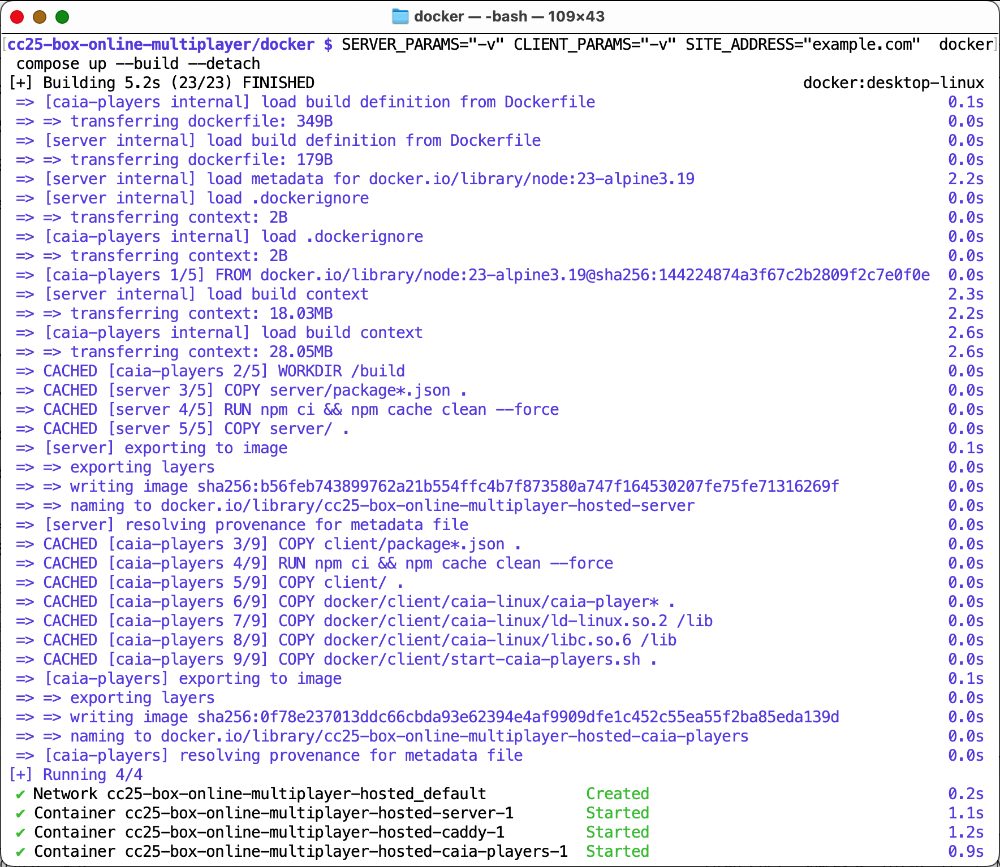

# Docker

This folder has all the files required to create the docker containers for the hosted server.  Instructions here can also be used to setup a local multiplayer server as well.

To start a local server bundled with three test players:

```
docker compose up --build
```

To run in detached mode:

```
docker compose up --build --detach
```

To stop the containers running in detached mode:

```
docker compose down
```

Local clients can specify the server as `-s http://localhost`

To start a hosted server on an example domain, say `example.com`:

```
SITE_ADDRESS=example.com docker compose up --build --detach
```

> This is how the hosted server at [https://box.servegame.com](https://box.servegame.com) is started.

By default, there is no verbose logging and only errors from the **server** or **client** components get printed.  To enable verbose logging, these can be passed through environment variables:

```
SERVER_PARAMS="-v" CLIENT_PARAMS="-v" SITE_ADDRESS="example.com" docker compose up --build
```

Here is how the output of that should look like:



## Notes

- The Container-Optimized OS in GCP does not include docker compose
  - Thus, it is installed through the [install-docker-compose-google-cos.sh](install-docker-compose-google-cos.sh) script
- The Alpine image that is the base for the **client** container does not have a valid libc needed for the `caia` test players and hence `libc.so.6` and `ld-linux.so.2` are packaged in that image. See [caia-linux](client/caia-linux/).
- Server [Dockerfile](server/Dockerfile)
- Client [Dockerfile](client/Dockerfile)
- Overall [docker-compose.yml](./docker-compose.yml)


