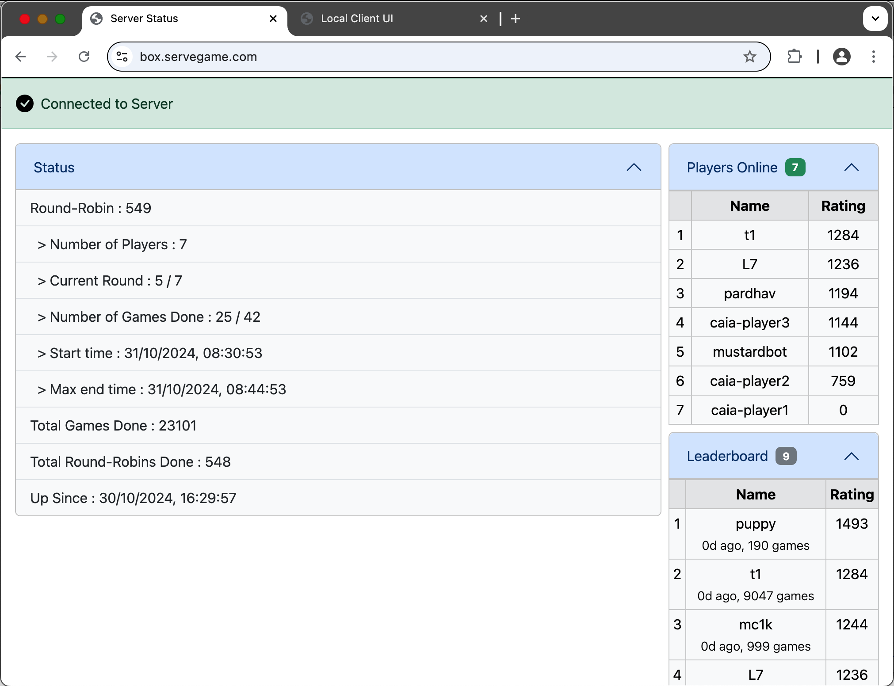

# CodeCup 2025 Box Online Multiplayer - Server

All the source code for the **server** component resides in this folder.

> Note that this section is not needed to take part in the Box Online Multiplayer as a participant.  This is relevant if you want to host your own local server or for other development needs.

Here are all the command line options available to run the server:

```
Usage: npm start -- [-p <port>] [-m <min_rr_players>] [-t <round_timeout>] [-v] [-h]
Options:
    -p|--port         : port number that server will listen on (default: 5000)
    -m|--minRRPlayers : minimum number of players to start a round-robin (default: 2)
    -t|--roundTimeout : per round timeout in seconds (default: 30)
    -v|--verbose      : show verbose output (default: false)
    -d|--debug        : show debug output (default: false)
    -h|--help         : show usage
```

All the options are optional.  The hosted server at [https://box.servegame.com](https://box.servegame.com) runs with the `-m 4` option because there are 3 test players and the rest being defaults as can be seen in the startup command in [docker-compose.yml](../docker/docker-compose.yml) in the `server` section.

## Hosted Server

The **server** component runs the code in this folder and is hosted on a `e2-micro` VM instance in the `us-west1` region of [Google Cloud Platform](https://cloud.google.com/) (GCP) as this falls under the free-tier.  The server is accessible via a free [No-IP](https://www.noip.com) hostname as [https://box.servegame.com](https://box.servegame.com).

The VM runs a [Container-Optimized OS](https://cloud.google.com/container-optimized-os/docs) image `cos-stable-117-18613-0-79`.  This **sever** component, a **client** component for the three test players (`caia-player1`, `caia-player2` and `caia-player3`) and a [caddy](https://caddyserver.com) server to provide HTTPS are all bundled through [Docker Compose](https://docs.docker.com/compose/) and details of these can be found in the [Docker](../docker/README.md) page.

The hosted server status is available at the same server URL: [https://box.servegame.com](https://box.servegame.com) and should look something like this:


